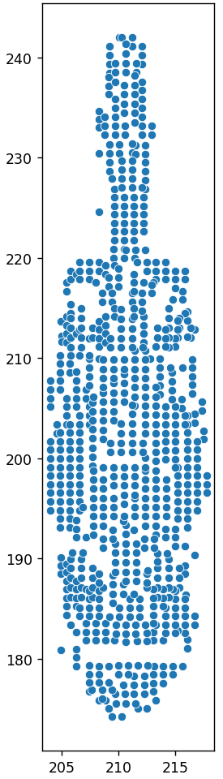
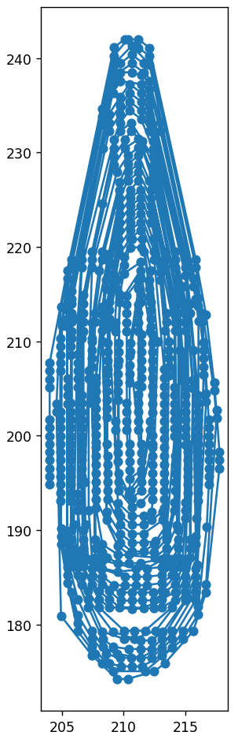
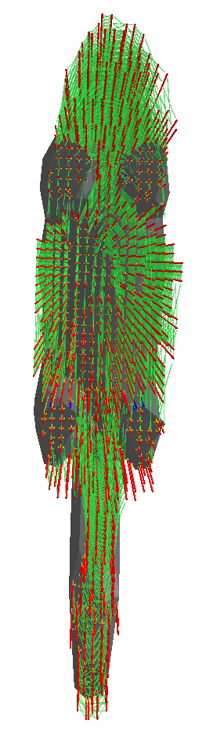

# Launching details
## Setting up the project
Cloning the realization of sorting points spirally:

`git clone https://github.com/XtereO/sorting_points_spirally.git`

For each directory (first sorting_points_spirally, then additive_spiral_supports!):
initializing virtual environment for each project (additive_spiral_supports and sorting_points_spirally)

`python -m venv venv`


Activating virtual environment

`.\venv\Scripts\activate`


Installing dependencies:

```
pip install -e .
pip install -r req.txt
```

## Launch the project
Before launching be sure that you have the cat.stl file in the root of additive_spiral_supports. 
After setting up the project we can launch the project (in root of additive_spiral_supports):

`python supports_6.py`

Actually if we would like to get the different export file format then we can pass it in launching command:

`python supports_6.py <here goes the file format>` 

example: `python supports_6.py stl`

The model with supports will be saved in the root of the directory additive_spiral_supports as "supported_model.stl"

## Code details
If you would like to turn off spiral ordering then in the code at line 890 put False value to the variable `spirally`.

If you would like to turn off vitalization of the spiral algorithm then at line 892 put False value as the second variable of function `sort_points_spirally`. 

# Project results
Using the file "cat.stl" gives the following results:

- Before sorting supports points spirally



- After sorting supports points spirally



- Visualization of 3d model


