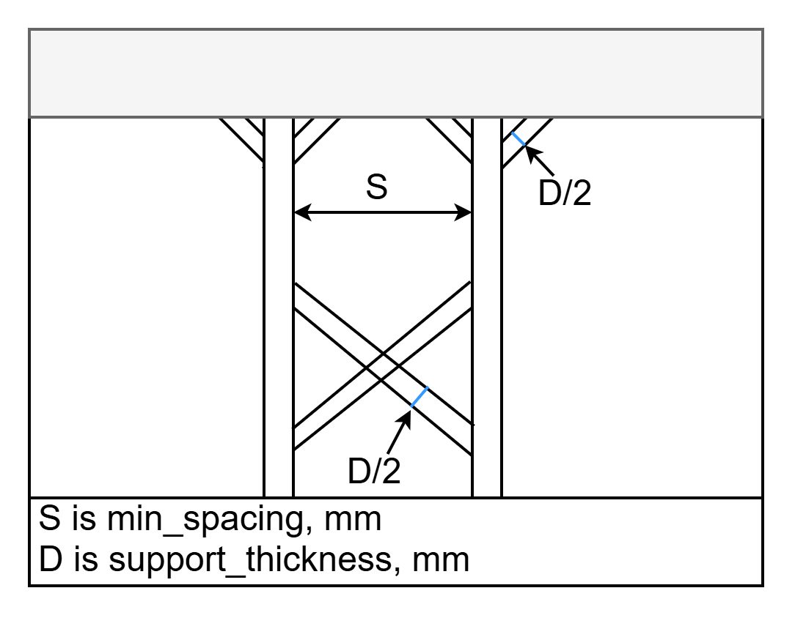
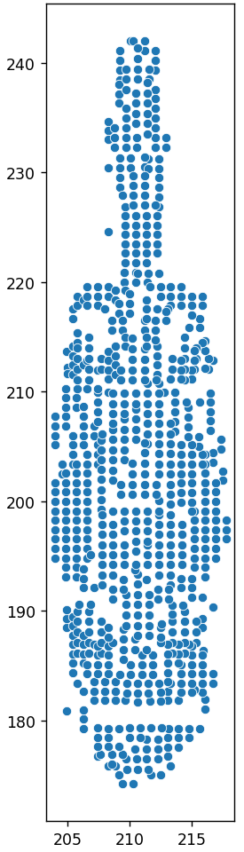
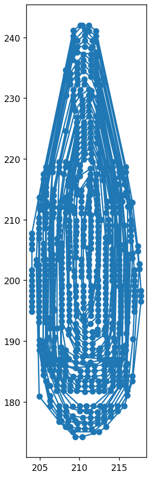
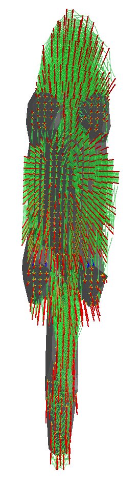

# Launching details
## Setting up the project
0. This project is set up on Python 3.13.7. 

1. Cloning the realization of sorting points spirally in the root of the project (additive_spiral_supports):

`git clone https://github.com/XtereO/sorting_points_spirally.git`

2. Initializing virtual environment for in the root of additive_spiral_supports:

`python -m venv venv`

3. Activating virtual environment:

`.\venv\Scripts\activate`

4. Installing dependencies:

```
pip install -e .
pip install -r req.txt
```

5. Bounding sorting_points_spirally:

```
cd sorting_points_spirally
pip install -e .
```

## Launching the project
Before launching be sure that you have the "cat.stl" file in the root of additive_spiral_supports. This file can be found at: https://disk.yandex.ru/d/aLFb94PN93zrDg.  
After setting up the project we can launch the project (in root of additive_spiral_supports):

`python supports_6.py`
Launching parameters in json file:
| Parameter title  | Values | Description | Default value |
|------------------|--------|-------------|---------------|
| file_path        | str    | relative path from the root to a stl file for generating supports | cat.stl |
| spirally_pattern | bool | true if it needs to connect supports spirally | true |
| min_spacing | float | the min distance between two support points | 0.7 |
| break_connection_distance | float | it prevents planned connection if its distance (Oxy) exceeds this value | 10 |
| tree_root_offset | float | the offset between a start of tree branch and a surface | 1.0 |
| support_thickness | float | the thickness of cylinder supports | 0.2 |
| support_cylinder_sections | int | quality of cylinder supports (the less value, the less memory it takes) | 8 |
| support_tree_sections | int | quality of tree supports | 6 |
| support_joint_subdivisions | int | quality of joints for connecting supports and a part (significantly influence on memory) | 4 |
| export_format | string | the file format of model with supports you want to get | stl |
| benchmark_run | bool | true if it needs to benchmark a time of sorting spirally code | false |



In general launching looks like this:

`python supports_6.py <json file with params as default_params.json (if no value provided then default_params.json will be used)>` 

example: `python supports_6.py default_params.json`

The model with supports will be saved in the root of the directory additive_spiral_supports as "supported_model.stl"

# Project results
Using the file "cat.stl" gives the following results:

- Before sorting supports points spirally



- After sorting supports points spirally



- Visualization of 3d model


